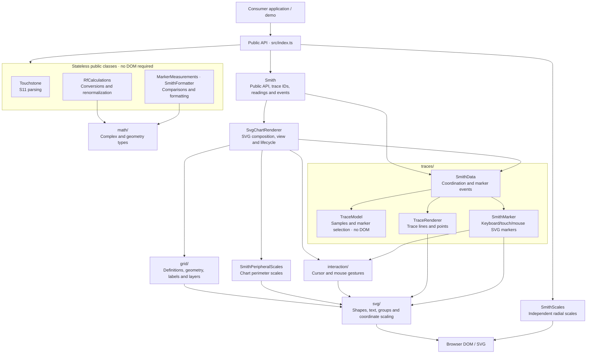

# Architecture overview

This diagram shows the main responsibilities and selected dependencies. Arrows
indicate that a component uses another component or exposes it through the public
API; this is not a complete import graph.

## Component boundaries

- [Public API](../src/index.ts): consumers, including the demo, import through the
  package entry point. Internal modules are not supported package entry points.
- [Smith](../src/Smith.ts): exposes chart operations, manages trace/marker identities, and owns
  reference impedance, subscriptions, and chart events. It delegates rendering to
  the internal `SvgChartRenderer`.
- [SvgChartRenderer](../src/rendering/SvgChartRenderer.ts): owns the chart SVG,
  ordered layers, SVG cursor, D3 zoom gestures, viewport scaling, resize observer,
  label layout, and SVG export. It creates and tracks trace coordinators for view
  updates and removes their rendered elements during cleanup. Cursor callbacks
  carry reflection coefficients; conversion to RF readings belongs to `Smith`.
- [LabelLayout](../src/svg/LabelLayout.ts): coordinates grid labels
  in the default view. It adjusts density and font sizes when the viewport or layer
  settings change, keeping the chosen labels stable during zoom and pan.
- [SmithData](../src/traces/SmithData.ts): coordinates one trace and its draggable
  markers. [TraceModel](../src/traces/TraceModel.ts) owns validated samples and
  marker selection without a DOM; [TraceRenderer](../src/traces/TraceRenderer.ts)
  owns SVG lines, points, styling, and viewport-based point reduction.
- [SmithScales](../src/scales/SmithScales.ts): mounts its own radial-scale container.
  The demo passes cursor and marker readings to it through chart events, so these
  scales remain outside the chart zoom transform. Peripheral scales belong to the
  chart and follow its transform.
- [RfCalculations](../src/rf/RfCalculations.ts),
  [Touchstone](../src/io/Touchstone.ts),
  [MarkerMeasurements](../src/MarkerMeasurements.ts), and
  [SmithFormatter](../src/SmithFormatter.ts): expose stateless class methods usable
  without constructing a chart or accessing a DOM.

Shared data contracts live in `samples.ts`, `measurements.ts`, and `layers.ts`.
See [Contributing](../CONTRIBUTING.md#architecture) for the folder map and project
conventions, and the [0.2.0 migration guide](migration-0.2.md) for class API changes.

## Renderer extraction scope

`SvgChartRenderer` is internal and is not exported from the package entry point.
The public `Smith` API, layer controls, event timing, default view, and drawing
order are unchanged. `Smith` no longer creates SVG elements or accesses D3
selections; its remaining D3 utilities validate colors and select default colors.

This is the first step toward multiple rendering backends, not a pluggable backend
API. The renderer still uses `SmithData` as a bridge to SVG trace/marker components;
`Smith` retains those coordinators for data operations and marker identities.
Marker interaction, SVG text measurement, and DOM-based SVG export remain in the
existing SVG implementations. `SmithScales` remains a separate SVG component.

The next boundary to extract is shared view and interaction state, followed by a
second rendering implementation that can validate an internal renderer contract.
Keep renderer classes internal until that contract has been exercised by another
backend.

## Appearance

`appearance/Theme` validates and resolves light/dark presets and partial overrides
without touching the DOM. `appearance/SvgTheme` applies component-scoped presentation
tokens to the chart SVG or the independent scale container. SVG components inherit
those tokens; explicit layer styles keep their precedence. `Smith` tracks automatic
trace color slots separately from explicit user colors, preserving IDs and selection
when a palette changes. Appearance updates remeasure grid labels without rebuilding
the SVG or resetting the view. The exporter resolves the tokens and includes the
configured background in standalone files.
