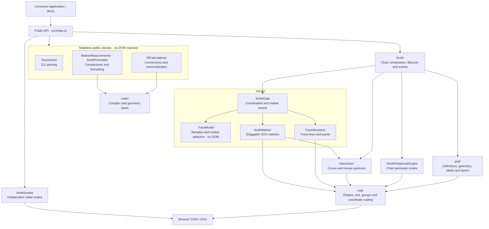

# Architecture overview

This diagram shows the main responsibilities and selected dependencies. Arrows
indicate that a component uses another component or exposes it through the public
API; this is not a complete import graph.

## Component boundaries

- [Public API](../src/index.ts): consumers, including the demo, import through the
  package entry point. Internal modules are not supported package entry points.
- [Smith](../src/Smith.ts): composes the chart, manages traces and markers, and owns
  zoom, lifecycle, and chart events.
- [LabelLayout](../src/svg/LabelLayout.ts): coordinates grid labels
  in the default view. It adjusts density and font sizes when the viewport or layer
  settings change, keeping the chosen labels stable during zoom and pan.
- [SmithData](../src/traces/SmithData.ts): coordinates one trace and its draggable
  markers. [TraceModel](../src/traces/TraceModel.ts) owns validated samples and
  marker selection without a DOM; [TraceRenderer](../src/traces/TraceRenderer.ts)
  owns SVG lines, points, styling, and viewport-based point reduction.
- [SmithScales](../src/scales/SmithScales.ts): mounts its own radial-scale container.
  The demo passes cursor and marker readings to it through chart events, so these
  scales remain outside the chart zoom transform. Peripheral scales belong to the
  chart and follow its transform.
- [RfCalculations](../src/rf/RfCalculations.ts),
  [Touchstone](../src/io/Touchstone.ts),
  [MarkerMeasurements](../src/MarkerMeasurements.ts), and
  [SmithFormatter](../src/SmithFormatter.ts): expose stateless class methods usable
  without constructing a chart or accessing a DOM.

Shared data contracts live in `samples.ts`, `measurements.ts`, and `layers.ts`.
See [Contributing](../CONTRIBUTING.md#architecture) for the folder map and project
conventions, and the [0.2.0 migration guide](migration-0.2.md) for class API changes.
